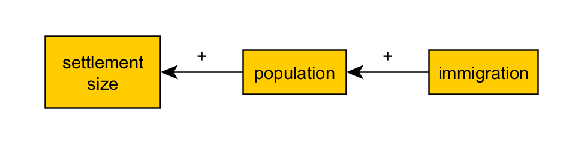
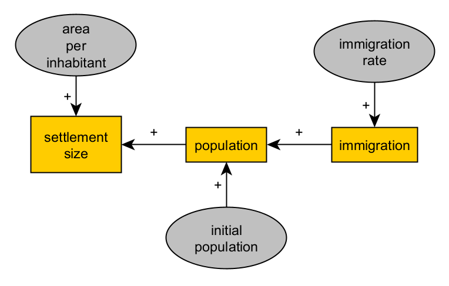
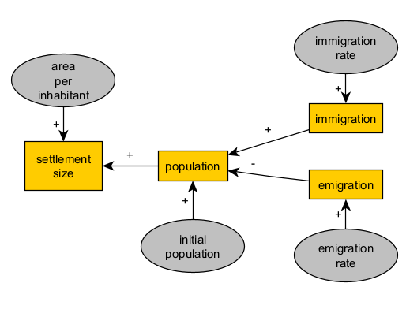
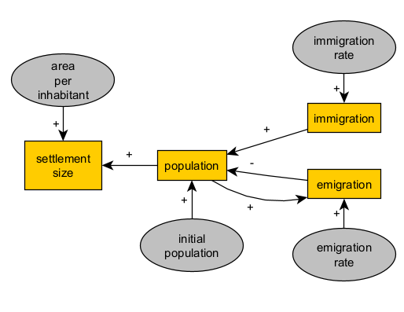
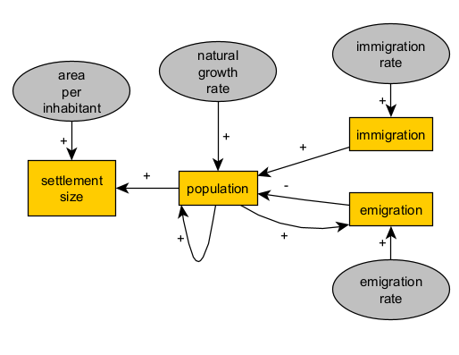
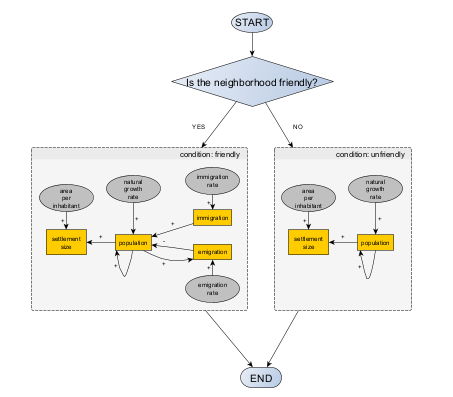
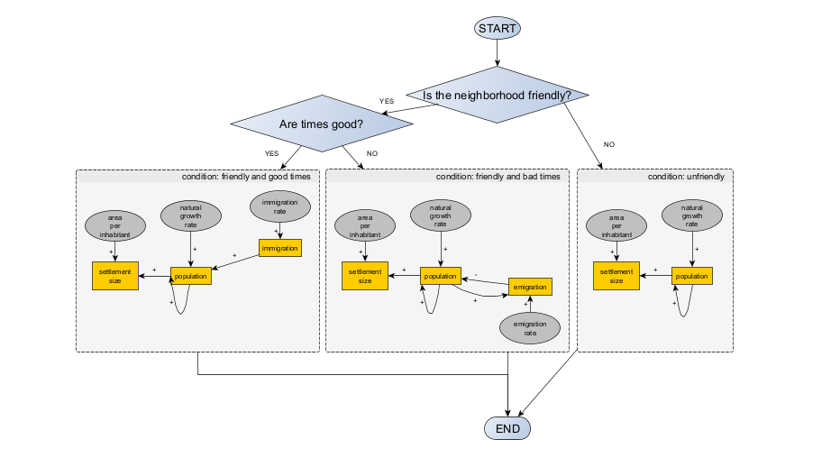
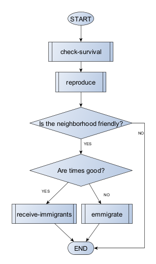
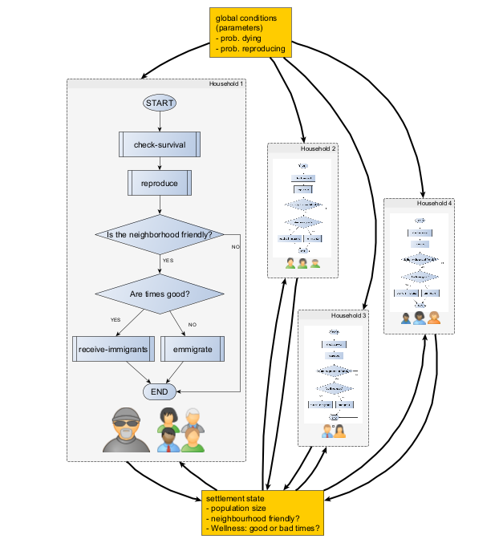
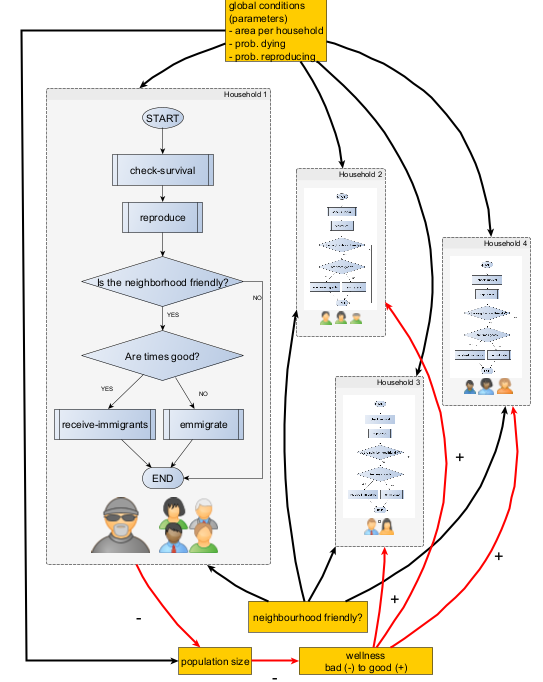

# Sesión 2: Ejercicio de modelado conceptual para simulación

¿Cómo pasamos de los datos a interpretaciones que requieren causalidad y cierta generalización? Aquí no entraremos en el aspecto técnico de la modelización computacional (es decir, la programación), sino que realizaremos un ejercicio guiado de "lápiz y papel" sobre los primeros y más desafiantes pasos en la modelización de simulación: la definición de un sistema de interés en relación con nuestras preguntas/hipótesis, y la formalización de las entidades o factores y las relaciones causales que se consideran involucradas. Para ello, no necesitarás más que lápiz y papel, un tema de interés, buenas habilidades de diagramación y una mente abierta.

## Objetivo

El objetivo de este ejercicio es introducir la primera y más importante etapa en la aplicación de la simulación, la definición de sistemas y  el diseño de modelos, a los temas de arqueología.

Dado un tema general de interés asociado a un determinado tipo de evidencias arqueológicas, debemos producir un modelo conceptual que contenga una definición de las características mínimas de un fenómeno o sistema (*representación*), con vistas a su formalización matemática (*mecanismo*) para que contribuya a la respuesta a una o más preguntas de investigación o a falsear o reformular una hipótesis de trabajo (*validación*).

Este ejercicio refleja el carácter exploratorio de la modelización explicativa, donde es clave cubrir el máximo de explicaciones potenciales a partir de nuestros conocimientos previos, pero también debemos avanzar parsimoniosamente hacia la definición de un modelo computacional (*implementación*) que sea inteligible y computable en un periodo de tiempo razonable.

## Evidencias arqueológicas y sus interpretaciones (*explicaciones*)

Se anima a elegir el campo de la arqueología y proponer el proceso en el pasado de acuerdo con los intereses y la experiencia previa del estudiante/investigador. Alternativamente, se puede utilizar como punto de partida una de las siguientes propuestas:

| Evidencias arqueológicas | Fenómenos del pasado (explicaciones candidatas) | mecanismos (explicaciones formalizadas) |
| ---------------------- | --------------------- | ------------------ |
| Distribución y tamaño de los asentamientos | Subsistencia, crecimiento demográfico dependiente de factores ambientales, movilidad y sedentarismo | ... |
| contexto funerario (número y estilo de los artefactos, determinación de la edad y el sexo, proximidad morfológica y genética entre los individuos, etc.) | Entierro ritual de ciertos individuos (creencias, composición poblacional, asimetrías y desigualdades, etc.), mortalidad (frecuencia, contextos), toma de decisiones y logística en cuanto a la práctica funeraria | ... |
| Detección de residuos orgánicos en la superficie de recipientes cerámicos | producción (tratamiento de superficies) y uso de recipientes (almacenamiento, cocción, consumo de alimentos), toma de decisiones en la producción, selección de recetas y componentes dietéticos | ... |
| Distribución y diversidad de variedades de un tipo de artefacto muy común (instrumentos líticos, cerámicas, etc.) | movimientos de personas y artefactos, transmisión cultural de formas de producción y/o uso de dichos artefactos | ... |
| Frecuencia de especies en el carbón vegetal entre los estratos de un yacimiento | Cambios climáticos que limitan o potencian el crecimiento por especies, tamaño selectivo, incendios, deforestación | ... |
| Datación C14 más antigua de la presencia de plantas y animales domesticados en sitios distribuidos por toda una región | crecimiento demográfico y migración, interacción entre grupos con y sin domesticación (intercambio, asimilación, conflicto, etc.) | ... |
| Volumen de un mineral extraído en un yacimiento con explotación minera, duración de la ocupación y actividad | Subsistencia y liberación del trabajo, toma de decisiones sobre intensidad minera, uso e intercambio de minerales | ... |

Es posible que prefiera delimitar primero un conjunto de tipos de evidencia arqueológica y luego identificar lo que cree que es la explicación más probable y/o más fuerte en términos de proceso generativo (de izquierda a derecha en la tabla). Sin embargo, es igualmente válido comenzar por considerar un fenómeno que ha sido documentado, estudiado y definido en otras disciplinas (por ejemplo, el comercio, desde una comprensión de la economía y la antropología), asumir que existió en un determinado contexto en el pasado y buscar dominios relevantes de evidencia que puedan apoyar o socavar dicha explicación (de derecha a izquierda en la tabla). En ambas rutas, no hay atajos; La solidez de la explicación dependerá de la profundidad y amplitud del conocimiento previo sobre la evidencia y los fenómenos.

## Esbozar un modelo conceptual *para el modelado de simulación*

Un modelo conceptual puede expresarse aquí de varias maneras, por ejemplo, como listas de elementos y relaciones, esquemas, diagramas, etc. Es decir, no forzaremos el uso de convenciones como [UML](https://en.wikipedia.org/wiki/Unified_Modeling_Language), aunque podría facilitar la siguiente etapa (*implementación*). Los ejemplos de diagramas UML también pueden servir de inspiración, incluso si no aprendes sus reglas. Otras convenciones más específicas también pueden ser muy útiles y relativamente fáciles de aprender:

- [Diagramas causal, de "stocks" y flujos, o Forrester](https://en.wikipedia.org/wiki/System_dynamics): útil para relacionar el cambio de variables agregadas (stocks) con parámetros y otras variables (flujos).
- [Diagramas de flujo](https://en.wikipedia.org/wiki/Flowchart): útil para representar flujos de lógica, especialmente procedimientos simples de toma de decisiones.

Vea algunos ejemplos de modelado conceptual en este tutorial: https://github.com/Andros-Spica/ABM-tutorial-koeln-2022?tab=readme-ov-file#conceptual-model

## El primer boceto de un mecanismo

La explicación seleccionada nunca es definitiva, ni es una declaración de creencia sesgada (*mi* interpretación). Debe ser la chispa y la dirección de un proceso abierto en el que ordenemos nuestros conocimientos y creencias en busca de consistencia lógica (formalización), los contrastemos con más evidencia (validación) y los revisemos o ampliemos. 

La formalización de una explicación es, de hecho, la tarea más desafiante en el modelado de simulación, especialmente en dominios tan complejos como la arqueología. Se trata, en primer lugar, de una forma de pensar más allá de cualquier habilidad técnica, de formación en matemáticas o en jerga específica de una disciplina. Por lo tanto, debe ejercerse en lugar de aprenderse.

Si la explicación elegida está presente en modelos formales ya desarrollados por otros, enhorabuena, probablemente podrías saltarte esto. Sin embargo, utilizar, adaptar o combinar modelos formales para su propia investigación requerirá una comprensión profunda de la formalización realizada y cómo se relaciona con los términos de su propia evidencia, pregunta, etc.

A modo de ejemplo, supongamos que postulamos que:

>El aumento de la superficie construida de un yacimiento arqueológico, que se supone que es un asentamiento, se explica por el crecimiento de la población debido a la afluencia migratoria.

Esta idea general podría expresarse de manera más esquemática como un conjunto de casos o escenarios. Aquí nos limitamos a dos:

>↑ inmigración → ↑ población → ↑ área de asentamiento
>↓ inmigración → ↓ población → ↓ área de asentamiento

También podemos simplificar esto dibujando un diagrama causal, un gráfico donde los nodos son las "cosas" que cambian (*variables* ser) y las aristas o flechas marcan la dirección de la causalidad y el signo del efecto (positivo o negativo):

Si nos sentimos cómodos con el álgebra, podríamos intentar traducirla a expresiones matemáticas:

>settlementArea = *f*(población) = *f*( *g*(inmigración) )

o

>settlementArea = *f*(población) 
>población = *g*(inmigración)

donde *f* y *g* son funciones, aún por definir. Tales expresiones reformulan la explicación original de una manera que es más amigable para una mayor formalización. Dicen:

>El área de asentamiento (variable) es una función (depende de) la población (variable).
>La población (variable) es una función (depende de) la inmigración (variable).

Sin ecuaciones para definir *f* y *g*, nuestra gráfica causal en realidad expresa más contenido leyendo:

>El área de asentamiento (variable) es una función (depende de) la población (variable) como un término positivo (+).
>Población (variable) es una función (depende de) la inmigración (variable) como un término positivo (+).

## Hacia un equilibrio entre representación y complejidad

¿Es esta una descripción satisfactoria de nuestra explicación? ¿Está dejando de lado algo que en realidad estamos entendiendo implícitamente con nuestra primera explicación informal? ¿Es ir demasiado lejos, afirmar algo que no pretendíamos en primer lugar? El criterio para responder a esta pregunta parte de la representación de la explicación informal y entra en el ámbito de la lógica y de un conocimiento contextual más amplio.

En nuestro ejemplo, podemos detectar inmediatamente que nuestras variables deben expresarse en al menos dos unidades diferentes (por ejemplo, $m^{2}$ e individuos). Debemos añadir un parámetro (una variable que se mantiene constante durante todo el proceso) para convertir cantidades de población en cantidades de área de asentamiento:

>settlementArea = *f*(areaPerInhabitant * población) 

Además, imaginemos que nos parece insuficiente describir el cambio de población considerando solo la inmigración (es decir, *g*(inmigración)). No puedes saber cuántas manzanas hay en una canasta solo contando las que agregas. Es decir, necesitamos una población inicial:

>población = *g*(**población inicial**, inmigración)

Siguiendo el mismo razonamiento, también debemos considerar que las variables pueden cambiar intrínsecamente debido al paso del tiempo:

>settlementArea = *f*(areaPerInhabitant * población, **time**) 
>población = *g*(población inicial, inmigración, **tiempo**)

Si el área de asentamiento y la población cambian con el tiempo (depende de) él, ¿también lo haría la inmigración? En caso afirmativo, también tendremos que considerar un término adicional, el parámetro que determina la tasa de cambio en la inmigración:

>settlementArea = *f*(población, **tiempo**) 
>población = *g*(población inicial, inmigración, **tiempo**)
>inmigración = *h*(immigrationRate, **time**)

Nuestro gráfico causal será en este punto considerablemente diferente, incluso cuando asumimos el tiempo como implícito:

Después de unas cuantas iteraciones de este proceso de razonamiento, nuestras expresiones formales seguramente crecerán en complejidad. Cuantas más variables y parámetros tenga un modelo explicativo de este tipo, más realismo y riqueza de escenarios permitirá. Sin embargo, las variables y los parámetros deben ser controlados por la evidencia o al menos definidos de manera significativa.

Depende de usted, a la luz de su contexto de investigación y sus preguntas, decidir cuándo sacrificar la *representatividad* de su modelo para garantizar que pueda ser implementado, comprendido y validado en el futuro.

## Reutilización de estructuras consolidadas

Cuando estamos satisfechos con una estructura en nuestro formalismo, es posible que queramos reutilizarla para extender el modelo para representar aspectos similares o simétricos de los fenómenos, sin hacerlo menos inteligible. Por ejemplo, si nuestro modelo es considerar la inmigración como una causa, también podríamos dar cuenta de un flujo de emigración con un efecto opuesto sobre la población. 

## Adición de bucles de retroalimentación

Al representar procesos, debemos tener en cuenta que la causalidad no es necesariamente una relación unilateral. Debido a que estamos factorizando el paso del tiempo, se puede modelar una variable para que se afecte a sí misma (en el futuro) u otras variables que hayan influido previamente en su valor.

Por ejemplo, la población afectará positivamente a la cantidad de emigración en un tiempo determinado.

Lectura:
>Población (variable) es una función (depende de) la emigración (variable) como un término negativo (-).
>La emigración (variable) es una función (depende de) la población (variable) como un término positivo (+).

Con esta idea, podemos reemplazar el parámetro "población inicial" con un bucle positivo (población-población) y también mejorar nuestra representación de cómo funciona una población real y permitir una tasa de crecimiento que sea independiente de los flujos migratorios.

Con este nivel de formalización y complejidad, nuestro modelo comenzará a acercarse bastante a un modelo de simulación completamente especificado e implementado bajo el marco de [dinámica de sistemas](https://en.wikipedia.org/wiki/System_dynamics).

## Expresar las condiciones como bifurcaciones lógicas

La mayoría de las veces, las explicaciones no se pueden formalizar únicamente con grafos causales y expresiones algebraicas como las anteriores. Uno de los casos más comunes es cuando queremos representar un proceso que solo ocurre si se cumplen ciertas condiciones.

Imaginemos, por ejemplo, que nuestro modelo de población impulsado por la migración debe tener en cuenta el efecto combinado de dos factores:

1. La relación política entre este y los asentamientos vecinos (amistoso/inamistoso) 
2. El estado general de la situación (por ejemplo, un factor combinado de subsistencia, bienestar, disponibilidad de materias primas, etc.), resumido en *buenos* y *malos* momentos. 

Introducir el factor 1 puede ser sencillo. Las relaciones hostiles impedirán cualquier flujo migratorio, de entrada o de salida. El boceto correspondiente de un diagrama de flujo podría ser:

El factor 2 creará otra bifurcación, relevante solo si el vecindario del asentamiento es *amigable*. Si los tiempos son *buenos*, asumiremos que la inmigración se activa, debido a que el asentamiento es atractivo para los nuevos residentes. Si los tiempos son *malos*, se activa la emigración, para representar el creciente número de habitantes que están insatisfechos con las condiciones de vida locales.

Cuanto más compuesto su modelo formal esté compuesto por algoritmos en lugar de ecuaciones, más engorroso será el uso de diagramas causales y más fácil el uso de diagramas de flujo y otros diagramas (por ejemplo, los de UML). Sin embargo, en lo que respecta al desarrollo de modelos y la comunicación, ANY es mejor que ningún diagrama o formalismo conceptual.

## Epílogo: representación de mecanismos distribuidos y sociales

Al apuntar a un modelo formal capaz de dar cuenta de los procesos distribuidos (que ocurren en paralelo a través de la acción de múltiples entidades) y los mecanismos sociales adecuados, nuestro modelo conceptual debe moverse hacia un marco basado en objetos y, eventualmente, en un marco basado en agentes. Hay muchas formas de representar procesos distribuidos, como formular variables como vectores y matrices, si las ecuaciones siguen siendo un formato viable, o dibujar diagramas de flujo para prescribir el comportamiento de las entidades y su posible interacción.

Si nuestro modelo poblacional se formulara como agente, considerando a los hogares como las principales unidades de proceso, tendríamos que definir su comportamiento de una manera que aún represente la esencia de la relación causal que pretendemos formalizar:

Este diagrama representa la secuencia de procesos internos (cálculos, decisiones, acciones, etc.) que se aplicarían una vez cada paso de tiempo para cada hogar (agentes) en una población (de agentes domésticos). De acuerdo con nuestro diagrama, los agentes recopilarían cierta información del entorno (estado de vecindad, bienestar del asentamiento) y considerarían las condiciones globales (por ejemplo, probabilidades de supervivencia y reproducción).

Podemos visualizar el sistema agregado como:

Observe que este tipo de diagrama combina diagramas de flujo (agentes) con los diagramas causales que usamos antes. En esta forma tentativa, que podría mejorarse mucho en detalles, el diagrama ya puede indicarnos lo que requiere una mayor formalización. ¿Cómo y en qué proceso afecta la probabilidad de morir a los hogares? ¿Cómo se contabiliza la presencia de un hogar en el tamaño de la población del asentamiento? 

Un diseño basado en agentes a menudo incluiría la interacción entre agentes; sin embargo, no en este caso. Una posible extensión que agregaría una interacción indirecta sería hacer que el bienestar del asentamiento dependiera de cuántos agentes del hogar decidan quedarse o irse, como una medida de la llamada "presión demográfica" a nivel poblacional. Podríamos visualizar dicho efecto, utilizando relaciones causales simples (flechas + o -) que muestran cómo un hogar afecta al tamaño de la población (+) que a su vez afecta al bienestar (-), lo que a su vez provoca la emigración de uno o más hogares (-).

Sin una mayor especificación de los procesos dentro de cada procedimiento de agente (es decir, la supervivencia, la reproducción, etc.), el diagrama de comportamiento anterior representaría a grandes rasgos las mismas relaciones causales que hemos propuesto a nivel de asentamiento. La inmigración y la emigración seguirían sumando o restando a la población, dependiendo de si el barrio es amigable y los tiempos son buenos o malos.

Sin embargo, modelar los procesos de forma distribuida (es decir, utilizando agentes como unidad computacional) también saca a la luz incoherencias lógicas, ambigüedades, problemas de representación o incluso nuevas preguntas sobre los supuestos e implicaciones de nuestro modelo.

Por ejemplo:

- ¿Deben tenerse en cuenta los inmigrantes entrantes (hogares) en nuestro modelo antes de integrarse en la población del asentamiento? ¿Se están mudando de otro asentamiento de acuerdo con la misma regla de comportamiento (es decir, los malos tiempos te hacen irte)?  
- ¿Pueden los hogares percibir el estado del vecindario de su asentamiento y el bienestar actual? ¿Cómo? ¿Todos comparten las mismas percepciones? ¿Con qué frecuencia no seguirían la regla (comportamiento modelado)?  
- ¿Es la representación de la migración como comportamiento familiar la más adecuada? ¿Qué significan parámetros como ¿O podemos/debemos postular que los individuos dentro de los hogares también migran, en número suficiente para impactar el cambio en el área de asentamiento?  

Además, hay que tener en cuenta que una vez que un proceso se conceptualiza como distribuido, será cada vez más difícil mantener la descripción del modelo conceptual en una sola expresión formal o diagrama. Eventualmente, las desventajas de trabajar con demasiados diagramas demasiado detallados requerirán entrar en la implementación del modelo (programación), posiblemente pasando por algunos prototipos. La implementación ayudará a definir, resumir y verificar las especificaciones del modelo conceptual. 

