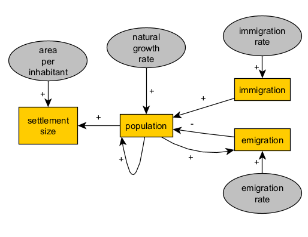
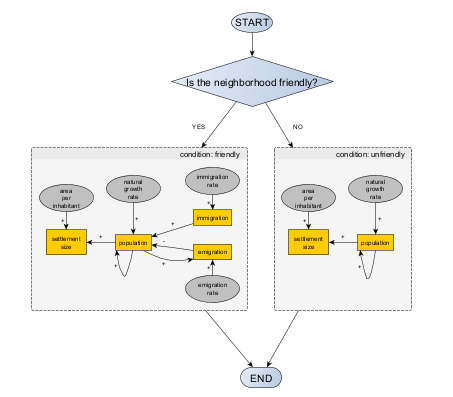
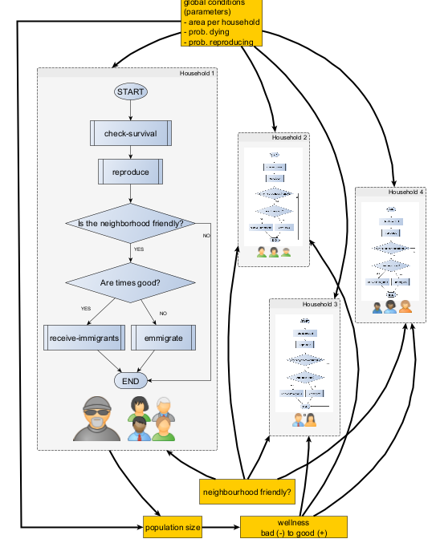
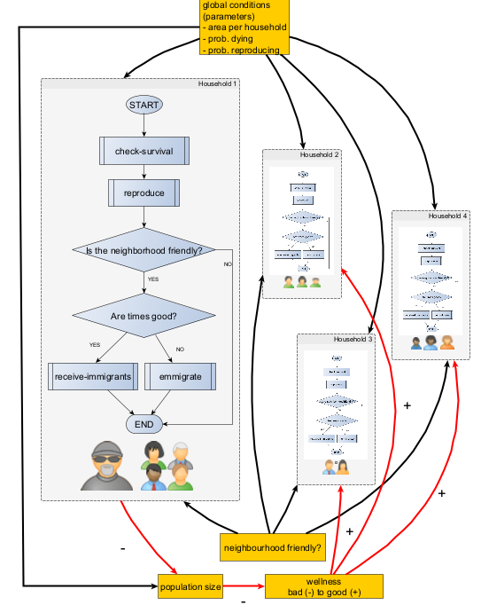

# Session 2: Exercise on conceptual modeling for simulation

How do we go from data to interpretations that require causality and certain generalisation? Here we will not go into the technical side of computational modelling (i.e. programming) but rather perform a guided "pen-and-paper" exercise about the first and most challenging steps in simulation modelling: the definition of a system of interest in relation to our question/hypotheses, and the formalisation of the entities or factors and causal relationships considered to be involved. For this, you will need no more than pen and paper, a subject of interest, good old diagramming skills, and an open mind.

## Aim

The objective of this exercise is to introduce the first and most important stage in the application of simulation, **system definition** and **model design**, to archeology topics.

Given a general topic of interest associated with a certain type of archaeological evidence, we must produce a conceptual model that contains a definition of the minimum features of a phenomenon or system (*representation*), with a view to its mathematical formalization (*mechanism*). so that it contributes to the answer to one or more research questions or to falsify or reformulate a working hypothesis (*validation*).

This exercise reflects the exploratory nature of explanatory modeling, where it is key to cover the maximum of potential explanations from our prior knowledge, but we must also advance parsimoniously towards the definition of a computational model (*implementation*) that is intelligible and computable in a reasonable period of time.

## Archaeological evidence and its interpretations (*explanations*)

It is encouraged to choose the field of archeology and propose the process in the past according to the interests and previous experience of the student/researcher. Alternatively, one of the following proposals can be used as a starting point:

| archaeological evidence | phenomena in the past (candidate explanations) | mechanisms (formalised explanations) |
| ---------------------- | --------------------- | ------------------ |
| distribution and size of settlements | subsistence, demographic growth dependent on environmental factors, mobility and sedentary lifestyle | ... |
| funerary context (number and style of artifacts, determination of age and sex, morphological and genetic proximity between individuals, etc.) | ritual burial of certain individuals (beliefs, population composition, asymmetries and inequalities, etc.), mortality (frequency, contexts), decision making and logistics regarding funerary practice | ... |
| detection of organic residues on the surface of ceramic vessels | production (surface treatment) and use of vessels (storage, cooking, food consumption), decision making in production, selection of recipes and dietary components | ... |
| distribution and diversity of varieties of a very common type of artifact (lithic instruments, ceramics, etc.) | movements of people and artifacts, cultural transmission of ways of producing and/or using said artifacts | ... |
| frequency of species in charcoal between the strata of a deposit | climate changes that limit or enhance growth by species, selective size, fires, deforestation | ... |
| oldest C14 dating of the presence of domesticated plants and animals in sites distributed throughout a region | demographic growth and migration, interaction between groups with and without domestication (exchange, assimilation, conflict, etc.) | ... |
| volume of a mineral extracted in a deposit with mining, duration of occupation and activity | subsistence and liberation of labor, decision making on mining intensity, use and exchange of minerals | ... |

You may prefer to first delimitate a set of types of archaeological evidence and then identify what you believe is the most likely and/or stronger explanation in terms of generative process (left to right in the table). However, it is equally valid to start by considering a phenomena that has been documented, studied and defined in other disciplines (e.g., trade, from an understanding in economics and anthropology), assume it existed in a certain context in the past and search for relevant domains of evidence that could support or undermine such explanation (right to left in the table). In both routes, there are no shortcuts; the robustness of the explanation will depend on the depth and width of the prior knowledge about the both evidence and phenomena.

## Sketching a conceptual model *for simulation modelling*

A conceptual model can be expressed here in various ways, for example as lists of elements and relationships, schemes, diagrams, etc. That is, we will not force the use of conventions such as [UML](https://en.wikipedia.org/wiki/Unified_Modeling_Language), although it could facilitate the next stage (*implementation*). Examples of UML diagrams can also offer inspiration, even if you don't learn their rules. Other more specific conventions can also be very useful and relatively easy to learn:

- [Causal, "stocks" and flows, or Forrester diagrams](https://en.wikipedia.org/wiki/System_dynamics): useful for relating the change of aggregate variables (stocks) to parameters and other variables (flows).
- [Flowcharts](https://en.wikipedia.org/wiki/Flowchart): useful for representing flows of logic, especially simple decision-making procedures.

See some examples of conceptual modeling in this tutorial: https://github.com/Andros-Spica/ABM-tutorial-koeln-2022?tab=readme-ov-file#conceptual-model

## The first sketch of a mechanism

The explanation selected is never final, nor it is a declaration of biased belief (*my* interpretation). It should be the spark and direction of an open-ended process where we order our background knowledge and beliefs in search of logical consistency (formalisation), contrast them with further evidence (validation), and revisit or extend them. 

The formalisation of an explanation is in fact the most challenging task in simulation modelling, especially in domains as complex as archaeology. It involves first of all a way-of-thinking beyond any technical skill, training in mathematics or discipline-specific jargon. Thus, it should be exercised rather than learned.

If the explanation chosen is present in formal models already developed by others, congratulations, you could probably skip this. However, using, adapting or combining formal models for your own research will require a deep understanding of the formalisation done and how it relates to the terms of your own evidence, question, etc.

As an example, suppose we postulate that:

>the increase in built area of an archaeological site, assumed to be a settlement, is explained by population growth due to migration influx.

This general idea could be express more schematically as set of cases or scenarios. Here we are limited to two:

>↑ immigration → ↑ population → ↑ settlement area  
>↓ immigration → ↓ population → ↓ settlement area

We can also simplify this by sketching a causal diagram, a graph where nodes are the "things" that change (*variables* to be) and edges or arrows mark the direction of causality and the sign of the effect (positive or negative):

If we are comfortable with algebra, we could attempt to translate it to mathematical expressions:

>settlementArea = *f*(population) = *f*( *g*(immigration) )

or

>settlementArea = *f*(population)  
>population = *g*(immigration)

where *f* and *g* are functions, still to be defined. Such expressions rephrases the original explanation in a way that is more friendly for further formalisation. They read:

>Settlement area (variable) is a function (depends on) population (variable).  
>Population (variable) is a function (depends on) immigration (variable).

Without equations to define *f* and *g*, our causal graph actually expresses more content by reading:

>Settlement area (variable) is a function (depends on) population (variable) as a positive term (+).  
>Population (variable) is a function (depends on) immigration (variable) as a positive term (+).

## Towards a balance between representation and complexity

Is this a satisfactory description of our explanation? Is it setting aside anything that we are actually implicitly understanding with our first informal explanation? Is it going too far, stating something that we did not intend at the first place? The criteria to answer this departs from representing the informal explanation and enters into the realm of logics and a broader contextual knowledge.

In our example, we can immediately spot that our variables must be expressed in at least two different units (e.g., $m^{2}$ and individuals). We must add a parameter (a variable that remains constant throughout the process) to convert amounts of population into amounts of settlement area:

>settlementArea = *f*(areaPerInhabitant * population)  

Furthermore, imagine that we find it to be insufficient to describe population change only considering immigration (i.e., *g*(immigration)). You cannot tell how many apples are in a basket only by counting the ones you add. That is, we need an initial population:

>population = *g*(**initial population**, immigration)

Following the same reasoning, we should also consider that variables may change intrinsically due the pass of time:

>settlementArea = *f*(areaPerInhabitant * population, **time**)  
>population = *g*(initial population, immigration, **time**)

If settlementArea and population changes with (depends on) time, would immigration also do it? If yes, then we will also need to consider an additional term, the parameter determining the rate of change in immigration:

>settlementArea = *f*(population, **time**)  
>population = *g*(initial population, immigration, **time**)
>immigration = *h*(immigrationRate, **time**)

Our causal graph will be at this point considerably different, even when we assume time as implicit:

After a few iterations of this reasoning process, our formal expressions will most certainly grow in complexity. The more variables and parameters in such an explanatory  model, the more realism and scenario richness it will allow. However, variables and parameters should be then controlled by evidence or at least meaningfully defined.

It is up to you, in light of your research context and questions, to decide when to sacrifice the *representativeness* of your model to ensure that it can be implemented, comprehended, and validated in the future.

## Re-using consolidated structures

When satisfied with a structure in our formalism, we might want to re-used it to extend the model to represent similar or symmetrical aspects of the phenomena, without making it less intelligible. For example, if our model is to consider immigration as a cause, we could also account for a emigration flux with an opposite effect over population. 

## Adding feedback loops

In representing processes, we must keep in mind that causality is not necessarily an unilateral relationship. Because we are factoring the pass of time, one variable can be modelled to affect itself (in the future) or other variables that have previously influenced its value.

For example, population will affect positively the amount of emigration in a given time.

Reading:  
>Population (variable) is a function (depends on) emigration (variable) as a negative term (-).  
>Emigration (variable) is a function (depends on) population (variable) as a positive term (+).

With this idea, we can replace the parameter "initial population" with an positive loop (population-population) and also improve our representation of how a real population works and allow for a growth rate that is independently of migration fluxes.  

With this level of formalisation and complexity, our model will start becoming quite close to a fully specified and implemented simulation model under the framework of [system dynamics](https://en.wikipedia.org/wiki/System_dynamics).

## Expressing conditions as logic bifurcations

More often than not, explanations cannot be formalised solely with causal graphs and algebraic expressions such as the above. One of the most common case is when we want to represent a process that only happens if certain conditions are met.

Imagine, for example, that our migration-driven population model must account for the combined effect of two factors:

1. the political relationship between this and neighboring settlements (friendly/unfriendly)  
2. the settlement general state of affairs (e.g. a combined factor of subsistence, wellness, raw material availability, etc), summarised as *good* and *bad* times. 

Introducing factor 1 can be straightforward. Unfriendly relationship will impede any flux of migration, in or out. The corresponding sketch of a flowchart could be:

Factor 2 will create yet another bifurcation, relevant only whether the settlement neighborhood is *friendly*. If times are *good*, we will assume that immigration is triggered, due to the settlement being attractive to new residents. If times are *bad*, emigration is activated instead, to represent the increasing number of inhabitants that are unsatisfied with local living conditions.

The more your formal model is composed by algorithms instead of equations, the more cumbersome it will be the use of causal diagrams and easier the use of flowcharts and other diagrams (e.g. those in UML). However, regarding model development and communication, ANY is better than no diagram or conceptual formalism.

## Epilog: representing distributed and social mechanisms

When aiming for a formal model able to account for distributed processes (happening in parallel through the action of multiple entities) and proper social mechanisms, our conceptual model should move towards an object-based and, eventually, an agent-based framework. There are many ways to represent distributed processes, such as formulating variables as vectors and matrices, if equations are still a viable format, or drawing flowcharts for prescribing the behaviour of entities and their potential interaction.

If our population model were to be formulated as agent-based, considering households as the main process units, we would need to define their behaviour in a way that still represents the essence of the causal relationship we aimed to formalise:

This diagram represents the sequence of internal processes (calculations, decisions, actions, etc.) that would apply once every time step for each household (agents) in a population (of household agents). According to our diagram, agents would gather certain information from the environment (state of neighbourhood, wellness of settlement) and consider global conditions (e.g., probabilities of survival and reproduction).

We can visualise the aggregate system as:

Notice that this kind of diagram combines flowcharts (agents) with the causal diagrams we used before. In this tentative form, which could be much improved in details, the diagram already can point us towards what requires further formalisation. How and in which process does the probability of dying affect households? How is the presence of a household accounted in the settlement's population size? 

An agent-based design would often include the interaction between agents; however, not in this case. A potential extension that would add an indirect interaction would be to make the wellness of the settlement dependent on how many household agents decide to stay or leave, as a measure of a so-called "population pressure" at the population level. We could visualise such effect, using simple causal relationships (+ or - arrows) showing how one household affects population size (+) which then affects wellness (-), which then cause the emigration of one or more households (-).

Without further specification of the processes inside each agent procedure (i.e., check-survival, reproduce, etc), the above behaviour diagram would broadly represent the same causal relationships we have proposed at the settlement level. Immigration and emigration would still add or subtract from the population, depending on whether the neighborhood is friendly and times are good or bad.

However, modelling processes in a distributed way (i.e. using agents as the computational unit) also brings to light logic incoherences, ambiguities, representation issues, or even new questions about the assumptions and implications of our model.

For example:

- Should incoming immigrants (households) be accounted for in our model before integrating into the settlement population? Are they moving out from another settlement according to the same behavioural rule (i.e., bad times make you leave)?  
- Can households perceive the state of their settlement's neighbourhood and current wellness? How? Do all share the same perceptions? How often would they not follow the rule (modelled behaviour)?  
- Is the representation of migration as household behaviour the most adequate? What does parameters such as  Or can/should we postulate that individuals within households migrate, too, in enough numbers to impact the change in settlement area?  

Moreover, notice that once a process is conceptualised as distributed, it will be increasingly harder to keep the description of the conceptual model in a single formal expression or diagram. Eventually, the downsides of working with too many, too detailed diagrams will require stepping into the implementation of the model (programming), possibly going through a few prototypes. Implementation will help to define, summarise, and verify the specifications of the conceptual model. 
